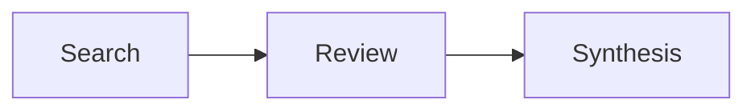
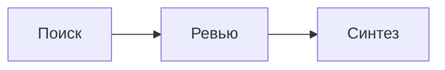

# Diagrams in a body

A fenced block tagged `mermaid` is rendered as an SVG diagram inside the body: a preview in the
text column, which the reader opens full-screen with a double click and inspects there with zoom
and panning. Everything else is a plain code block.

````

````

Two things decide whether the reader sees a diagram or a wall of text:

1. **The fence tag must be exactly `mermaid`.** Not `graph`, not `flowchart`, not `mmd`.
2. **The first non-empty line must open a supported type.** The renderer picks the type from
   that keyword — not from the fence — and an unsupported keyword means no diagram.

## Supported types

| First line starts with | Renders as | Section to read |
|---|---|---|
| `graph` / `flowchart` | flowchart | `flowchart` |
| `sequenceDiagram` | sequence | `sequence` |
| `stateDiagram` / `stateDiagram-v2` | state | `state` |
| `classDiagram` | class | `class` |
| `erDiagram` | ER | `er` |
| `xychart-beta` | chart | `chart` |

Anything else — `gantt`, `pie`, `journey`, `mindmap`, `gitGraph`, `timeline`, `quadrantChart` —
is **not supported**. There is no error: the block falls back to a code block, and the reader
gets your source instead of a picture.

## The parser forgives, and that is the real trap

Falling back to code is the *loud* failure — the reader at least sees the source. The quiet one
is worse: this parser accepts a great deal of broken input and draws something anyway.

```mermaid
graph TD
  A[Начало --> B{Развилка
  B ==>
```

An unclosed bracket, a label swallowing an arrow, an edge going nowhere — no error, no fallback.
The result is a diagram of two bare boxes, `A` and `B`, which looks deliberate and says nothing.

So "it rendered" is not the check. The check is whether the diagram shows what you meant:
every node you wrote, every label intact, every edge present.

Read a section for the type you need: `skill_get('mermaid', section='flowchart')`.

## Always give a diagram a heading

Put a heading directly above the fence and never reuse it in the same body:

`````
## Пайплайн ресёрча


`````

This is not decoration. `body_edit(code, action='replace_block', heading='## Пайплайн ресёрча')`
replaces that whole block — heading, diagram and all — in one call, so a diagram under its own
heading can be redrawn without touching anything else and without rewriting the body. A diagram
dropped into the middle of a section can only be edited by `replace` on a unique fragment of its
source, which breaks as soon as two diagrams share a line like `A --> B`.

Same reason to keep headings unique: `replace_block` needs exactly one match.

## Colours come from the app theme

Do not set a palette. The renderer is handed the app's own colour tokens and the diagram follows
the user's light/dark theme automatically. `classDef` / `style` / `linkStyle` still parse, but
every colour you hardcode is one that will look wrong in the other theme — use them only to mark
a genuine distinction (an error path, a highlighted node), never to decorate.

## Size is the whole game

The preview is **never cropped and never scrolls — it shrinks**. The diagram is scaled to fit
the text column (about 520 px wide) and a height cap (420 px by default; the reader can set
280 / 560 / unlimited). Whatever the layout computed, that is the box it has to fit into.

So the only question that matters is: what does the layout compute? Measurements from a real
body in this app:

| Diagram | Layout size | Shown at |
|---|---|---|
| flowchart, 5 short nodes, `TD` | 303 × 529 | 79% |
| sequence, 3 participants | 420 × 320 | 100% |
| **flowchart, 5 long Russian labels, `LR`** | **1399 × 74** | **38% — illegible strip** |
| **ER, 4 entities side by side** | **1554 × 202** | **34%** |
| **ER, 10 relations** | **1967 × 608** | **27% — grey ripple** |

Below roughly 60% the captions stop being readable, and the reader has to open the diagram
full-screen to learn anything from it. A diagram nobody can read in place has failed at being an
illustration, whatever it looks like when zoomed.

Three rules follow, in order of how much they buy:

1. **Label length drives width.** Box width is measured text, not character count. `A[Разбор
   markdown на клиенте]` is five times the width of `A[Разбор]`. Shorten captions before
   anything else — the detail belongs in the sentence next to the diagram.
2. **Prefer `TD` over `LR`.** A left-to-right chain multiplies label widths into one long line;
   top-down stacks them and stays inside the column. `LR` is for three or four short nodes.
3. **Split instead of squeezing.** Two diagrams under two headings beat one that has to render
   at 30%. This is also the reason each one wants its own heading anyway.

## Ids, labels and two verified traps

`A[Search sources]` — `A` is the node id, the brackets hold the label. Reuse the id to point at
the node again.

- **A space in an id is silently destructive.** `My Node[Label]` renders a node captioned
  `My` and the label is gone — no error, just a wrong diagram. Ids are single tokens:
  `MyNode[Label]`.
- **No trailing semicolon on the opening line.** `graph LR;` is rejected outright and the block
  falls back to code, even though classic mermaid allows it. Statement semicolons elsewhere are
  best dropped too.
- Punctuation inside a label is fine — parentheses, quotes, brackets, pipes and colons all
  render. Write the text you mean instead of contorting it.
- Labels are plain text; markdown inside them is not rendered as formatting.
- Keep labels short. The layout engine sizes each box by its text, so one long caption widens
  the entire diagram.
