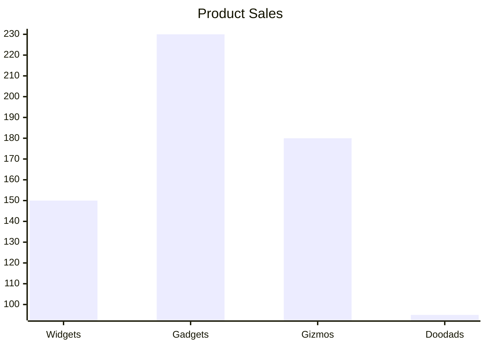
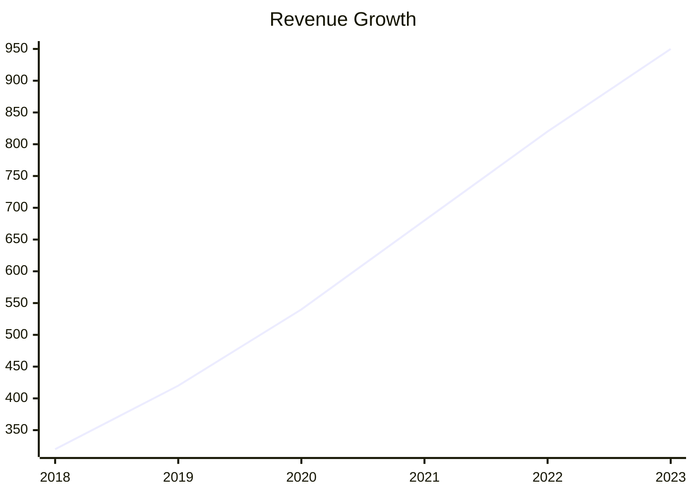
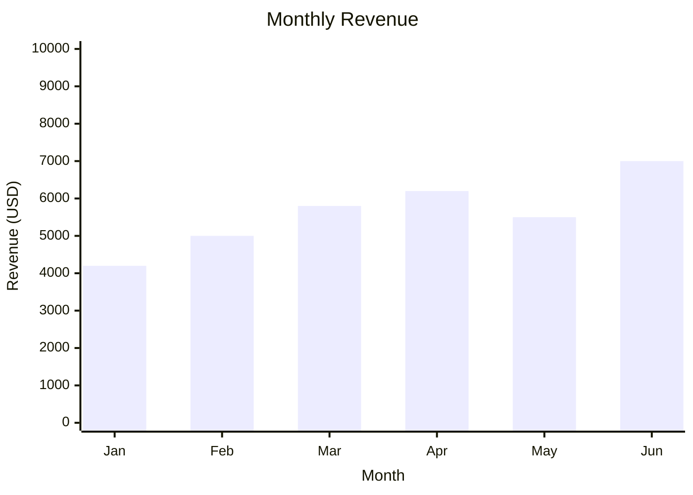
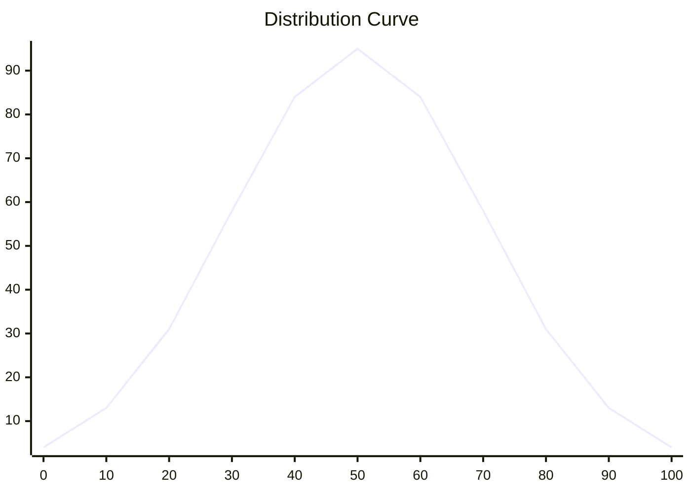
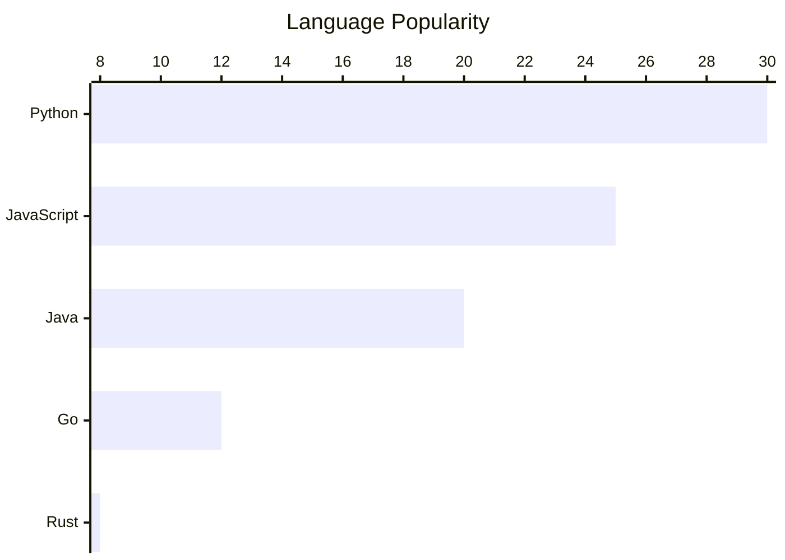

# Chart — `xychart-beta`

Bars and lines over one axis. The only charting type available here — there is no pie, no
scatter, no gantt.

## Bars

## Lines

## Axes

The x-axis is either a list of categories or a numeric range; the y-axis takes an optional label
and a range, and it is worth setting whenever the reader should see the scale:

With a numeric x-axis the values are spread across the range evenly — you give the series, not
the pairs.

## Several series, and horizontal bars

Repeat `bar` or `line`: bars land side by side, lines overlay. A `bar` and a `line` with the same
data draw the trend on top of the columns:

```mermaid
xychart-beta
    title "2023 vs 2024 Sales"
    x-axis [Q1, Q2, Q3, Q4]
    bar [200, 250, 300, 280]
    bar [230, 280, 320, 350]
```

`horizontal` on the opening line flips the orientation — the right choice when the category
names are long, because they get room instead of being crammed under the columns.

## Practical notes

- Indentation is free — two spaces, four or none all parse. Indent for readability of the source.
- Keep the number of values equal to the number of categories: a mismatch does not fail, it
  quietly draws a chart that does not match its axis.
- A legend is drawn, but the series are named for you — `Bar 1`, `Line 1`. There is no syntax to
  label them, so which is which must come from the title (`"Planned vs Actual"`) or from the
  sentence before the diagram. Two series is the honest maximum.
- No axis is inferred as a percentage or a currency — put the unit in the axis label.

> A chart of four numbers is a table pretending to be a picture. Reach for `xychart-beta` when
> the **shape** of the data is the point — a trend, a spike, a distribution — and for a table
> when the values themselves are.
