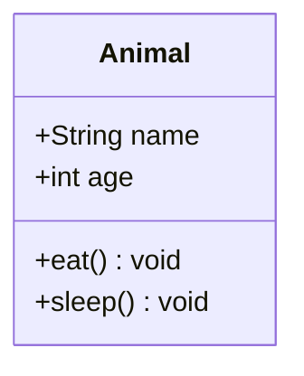
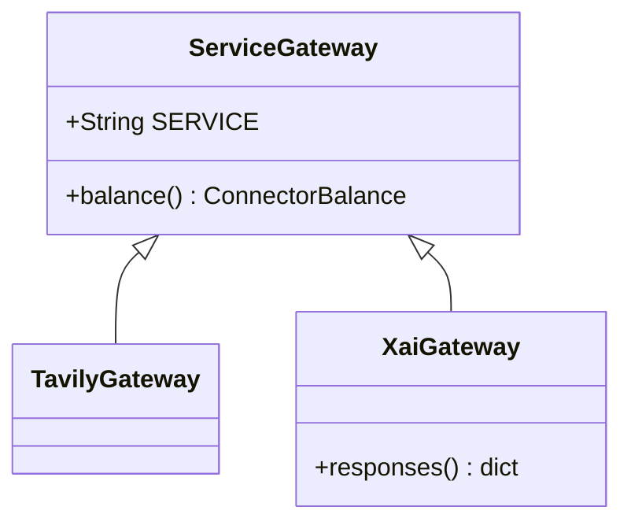
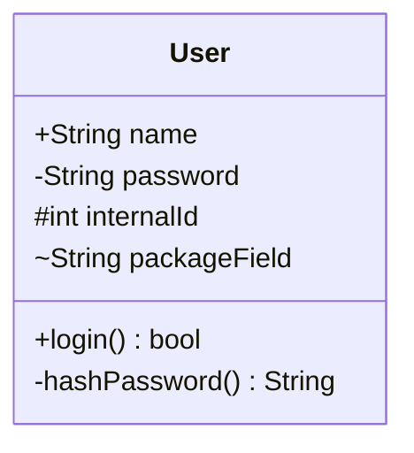
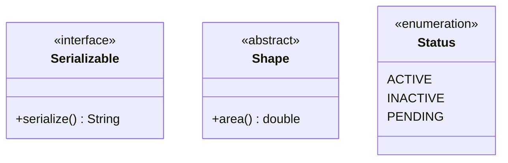
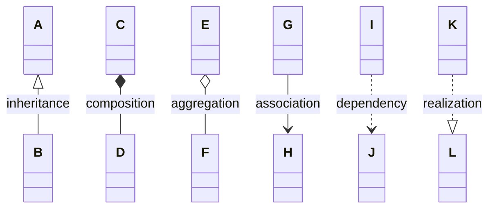
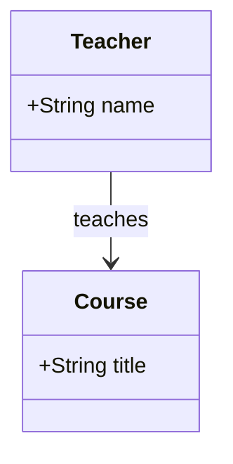
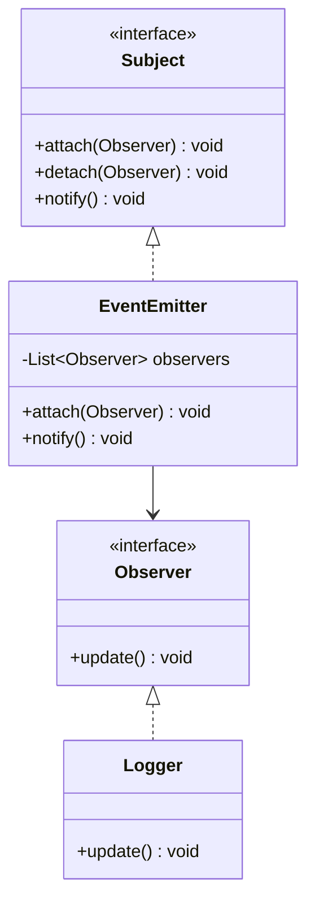

# Class — `classDiagram`

For type structure: classes, interfaces, what inherits from what. Useful when describing a
design or an existing module's shape.

## A class

A member is `<visibility><type> <name>` for a field and `<visibility><name>(args) <return>` for
a method — the type goes **first** for fields and **last** for methods.

The same members can be written one per line, outside any block. That form is easier to grow and
mixes freely with relationships:

## Visibility

`+` public, `-` private, `#` protected, `~` package.

## Annotations

An enum lists its values as bare members — no types, no visibility markers.

## Relationships

Read them as: `<|--` "B is an A"; `*--` "D is part of C and dies with it"; `o--` "F belongs to E
but outlives it"; `-->` "G uses H"; `..>` "I depends on J"; `..|>` "K implements L".

The label after `:` is optional and usually earns its place:

Generics are written with tildes: `-List~Observer~ observers`.

## Worked example — the observer pattern

> Only list the members that carry the point. A class box reproduced field-for-field from the
> source is a worse version of the source — the diagram exists to show the relationships.
