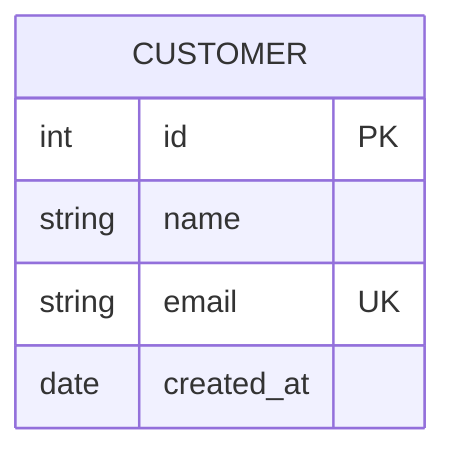
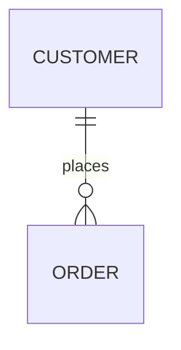
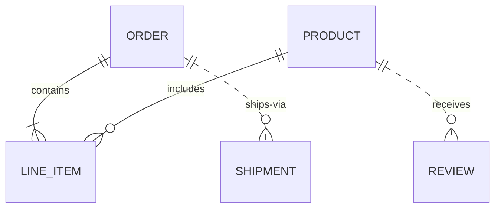
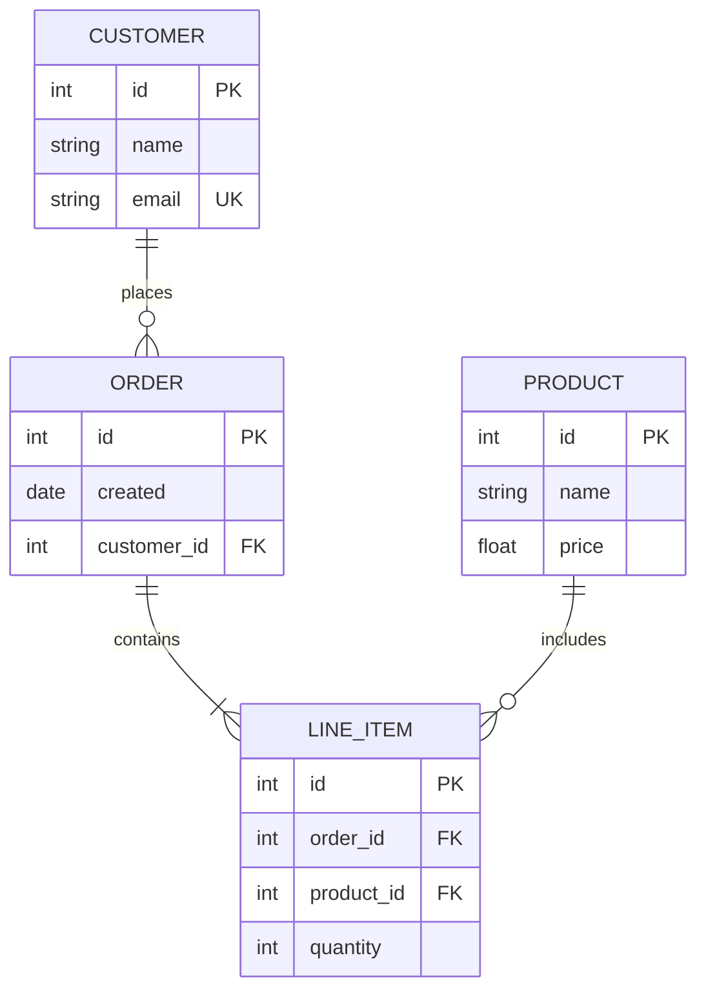

# ER — `erDiagram`

For data schemas: tables, columns, keys and how rows relate. The right diagram whenever the
subject is a database.

## Entities and attributes



An attribute line is `type name [key] ["comment"]` — type first, then the column name, then an
optional key badge: `PK` primary, `FK` foreign, `UK` unique. The type is free text, so a real
column type with parentheses works and is worth writing when the schema is the subject:
`string(25) code PK`.

> The entity name **is** the displayed name — there is no alias syntax. Write the real table
> name, in the case you want to see.

## Relationships



Cardinality is crow's foot, read outward from each entity:

| Marker | Meaning |
|---|---|
| `||` | exactly one |
| `o|` | zero or one |
| `|{` | one or many |
| `o{` | zero or many |
| `}|` | one or more (on the left side) |

```mermaid
erDiagram
  A ||--|| B : one-to-one
  C ||--o{ D : one-to-many
  E |o--|{ F : opt-to-many
  G }|--o{ H : many-to-many
```

The line style says whether the relation is identifying: `--` solid for an identifying one (the
child cannot exist without the parent), `..` dashed for a non-identifying one:



The label after `:` is read left-to-right: `CUSTOMER ||--o{ ORDER : places` → "customer places
orders". Quote it whenever it holds spaces or punctuation — `: "search_code, без FK"` — and the
quoted form is a safe default even for one word. When the diagram documents a real schema, the
column name usually says more than a verb does: `research_index ||--o{ research_area :
"research_code"`.

## Worked example — an e-commerce schema



## Practical notes

- **ER is the widest type there is** — entity boxes sit side by side and each one is as wide as
  its longest attribute line. Measured in this app: four entities in a row lay out at 1554 px
  and are shown at 34% of that, ten relations at 1967 px → 27%. Both are unreadable in place.
  Three or four entities per diagram is the working limit; split a schema by subsystem into
  several diagrams under their own headings.
- List the keys and the columns that carry meaning, not every column — the ER diagram is a map,
  and the exhaustive version lives in the migration.
- A soft reference (a column that points at another table without a real foreign key) is best
  drawn dashed: it is exactly a non-identifying relation.
