# Flowchart — `graph` / `flowchart`

The workhorse: pipelines, decision trees, architecture. `graph` and `flowchart` are
interchangeable openers.

## Direction

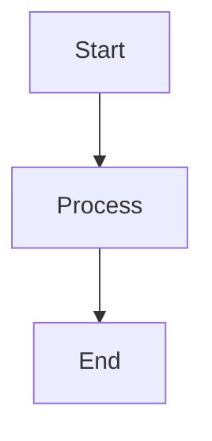

`TD` top-down (default choice, `TB` is the same thing), `LR` left-right, `BT` bottom-top,
`RL` right-left.

> `LR` is the most common way to ruin a diagram here: five nodes with sentence-long labels laid
> out left-to-right measure 1399 px and are shown at 38% — a strip of grey ripple. Use `LR` for
> three or four short nodes and `TD` for everything else.

## Shapes

Twelve shapes, and the brackets around the label pick one:

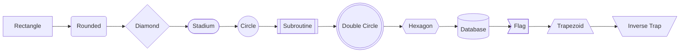

In practice four carry meaning and the rest are noise: `[…]` a step, `{…}` a decision,
`([…])` a start/end, `[(…)]` a store. Use a shape to say something, not to vary the picture.

## Edges

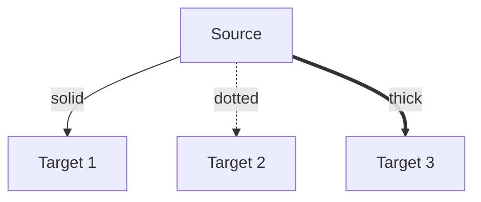

Without an arrowhead: `---` solid, `-.-` dotted, `===` thick. Bidirectional: `<-->`, `<-.->`,
`<==>`.

Labels come in two forms — `-->|label|` and `-- label -->`:

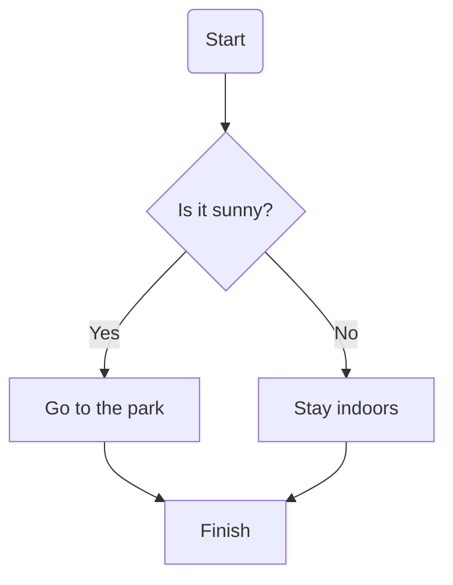

Chaining and fan-out keep the source short:

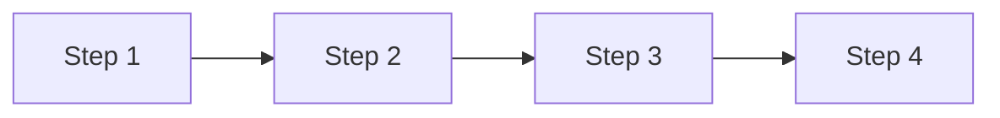

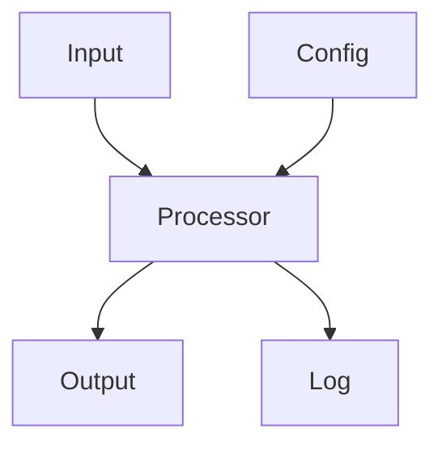

## Subgraphs

`subgraph id [Display label] … end` — the id is what edges point at, the bracketed label is what
the reader sees. `subgraph id ["Метка со словами"]` with quotes works too and is the safer form
for a label with spaces or punctuation. A subgraph may override the direction of its own
contents:

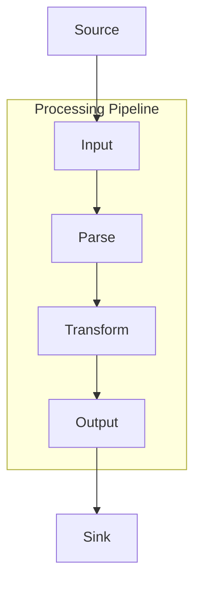

Nesting works, and edges may cross a boundary from outside:

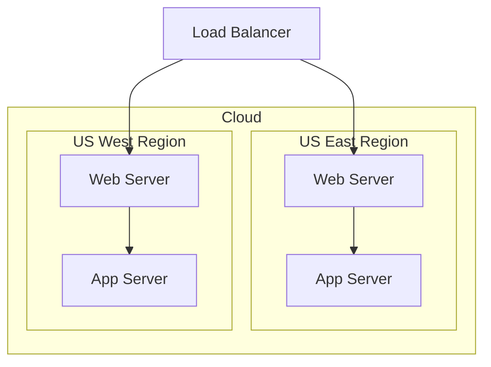

## Styling — sparingly

Colours are supplied by the app theme (see the main guide). When a distinction genuinely needs
colour, there are three ways:

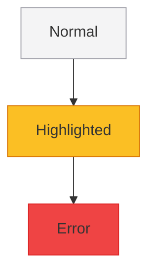

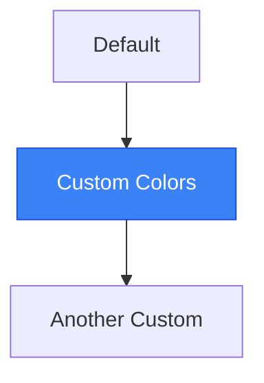

Both land in the rendered SVG. **`linkStyle` does not** — this renderer accepts the line without
complaint and ignores it, so edges cannot be coloured here. Carry the distinction on the nodes
(`:::class`) or in the edge label instead; a `linkStyle` block is dead weight that also reads to
the next author as if it worked.

## Worked example — a CI pipeline

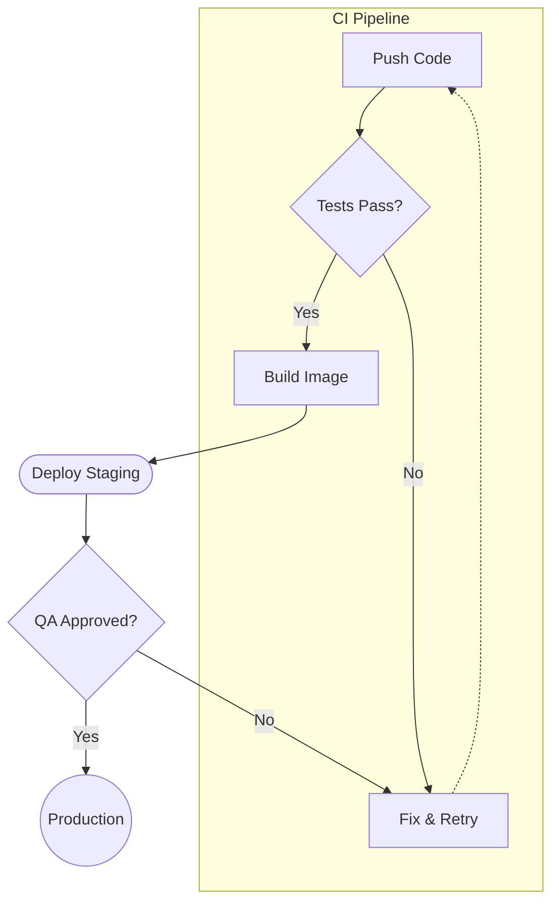
