# Sequence — `sequenceDiagram`

For protocols and call flows: who talks to whom, in what order. The best fit for describing an
integration, an auth handshake or a request path.

## Participants

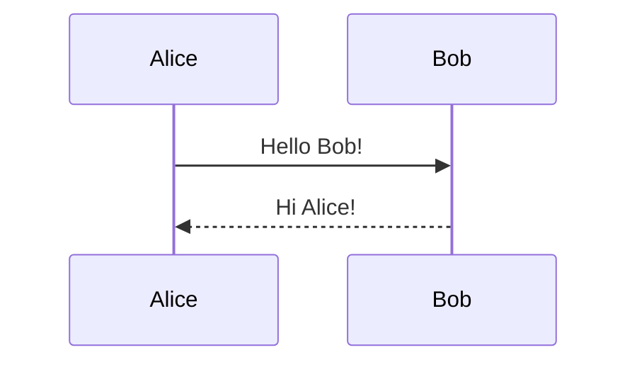

Declaring participants up front fixes their left-to-right order and lets you use short ids with
readable labels — this is also how you get a name with spaces, since ids cannot contain any:

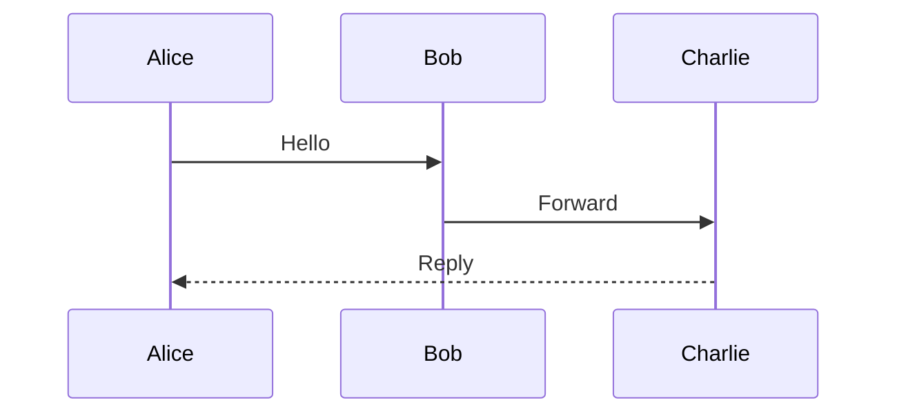

`actor` draws a stick figure instead of a box — use it for the human at the edge of the flow:

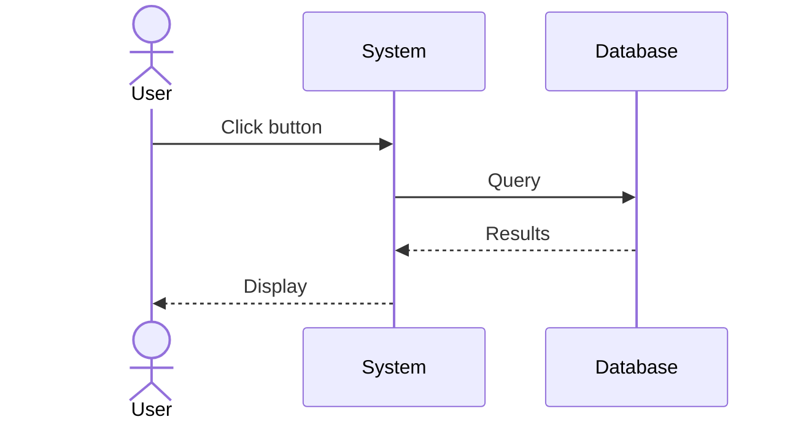

## Arrows

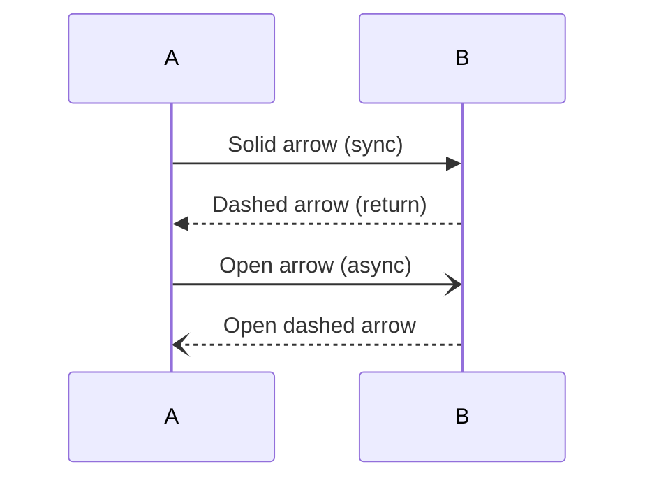

Convention worth keeping: solid `->>` for a call, dashed `-->>` for its answer. A reader picks
up the request/response rhythm from the line style alone.

## Activation and self-calls

`+` after the sender activates the receiver, `-` deactivates it — the lifeline grows a box for
the duration of the work:

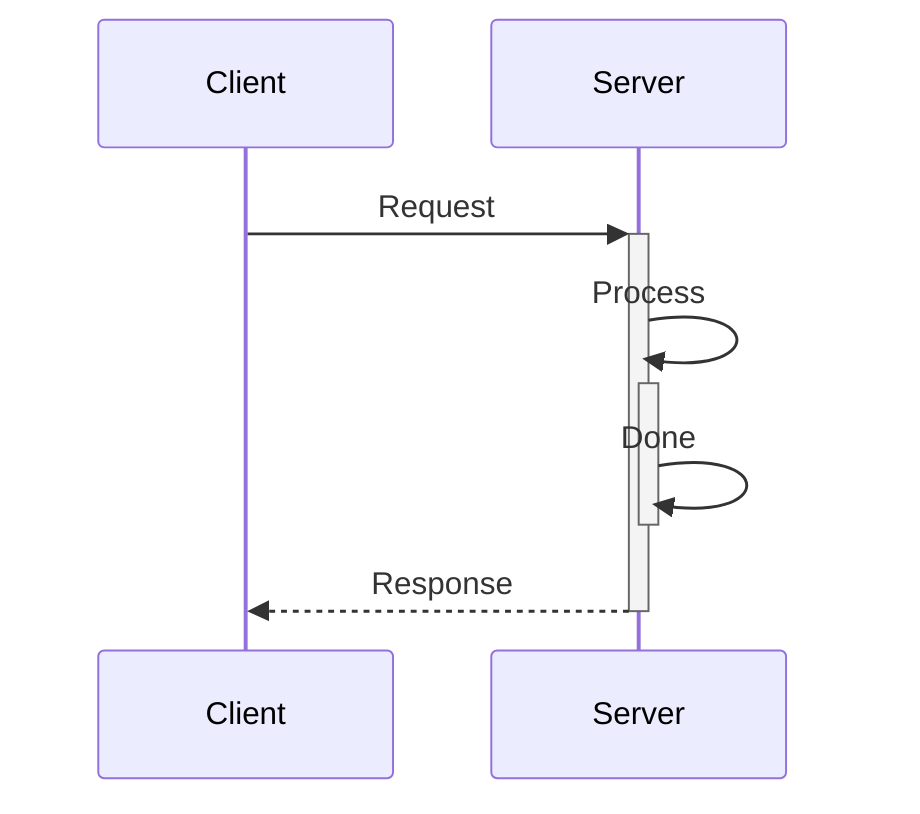

The same participant on both sides is a self-message, drawn as a loop arrow:

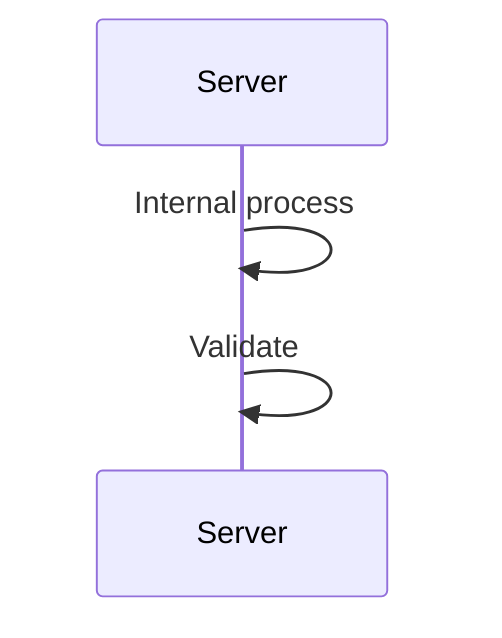

## Control blocks

`loop` — repetition:

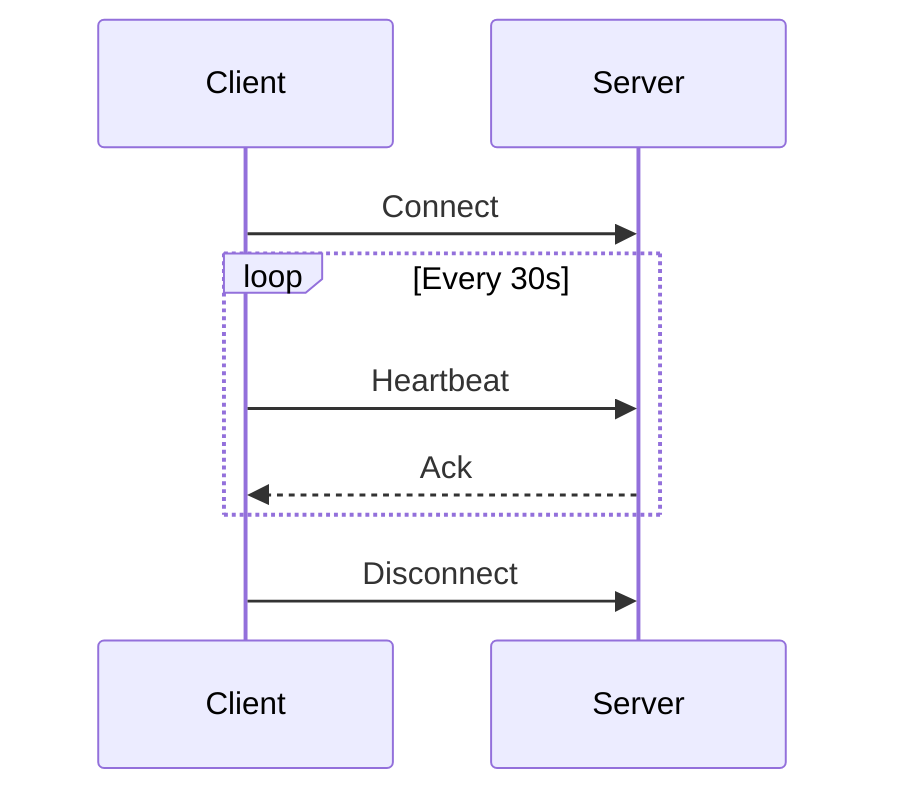

`alt` / `else` — branches, as many `else` arms as needed:

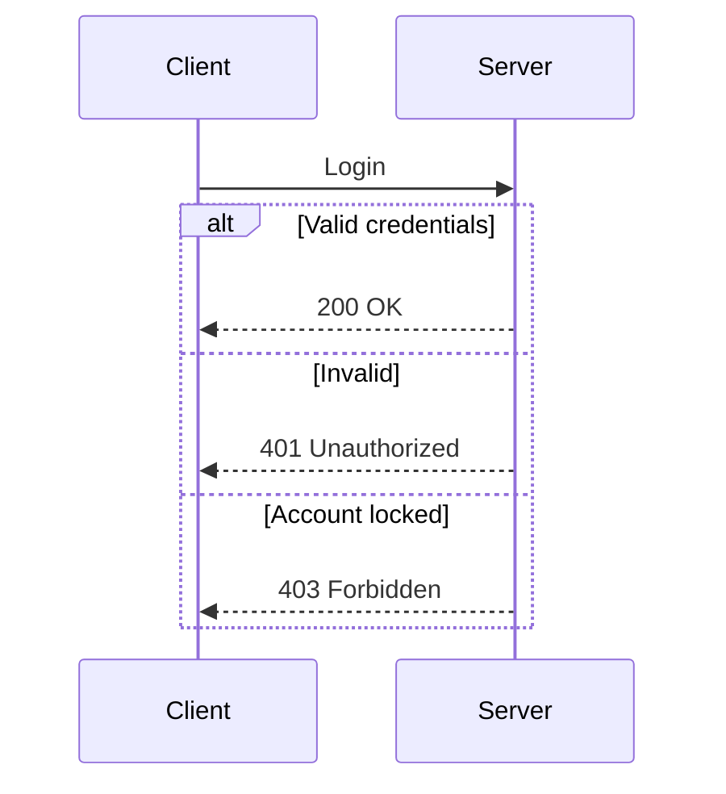

`opt` — a branch that may simply not happen; `par` / `and` — work that happens at the same time;
`critical` — a section that must not be interrupted:

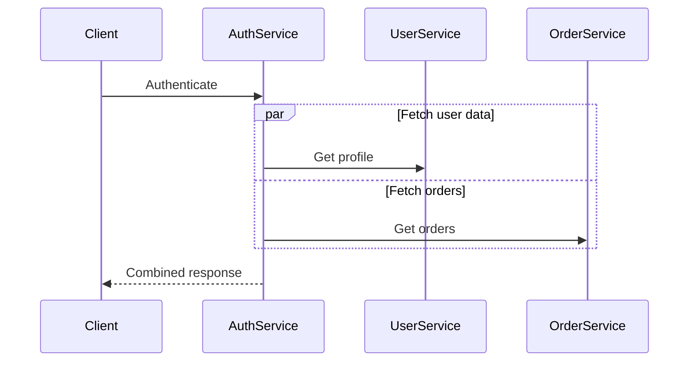

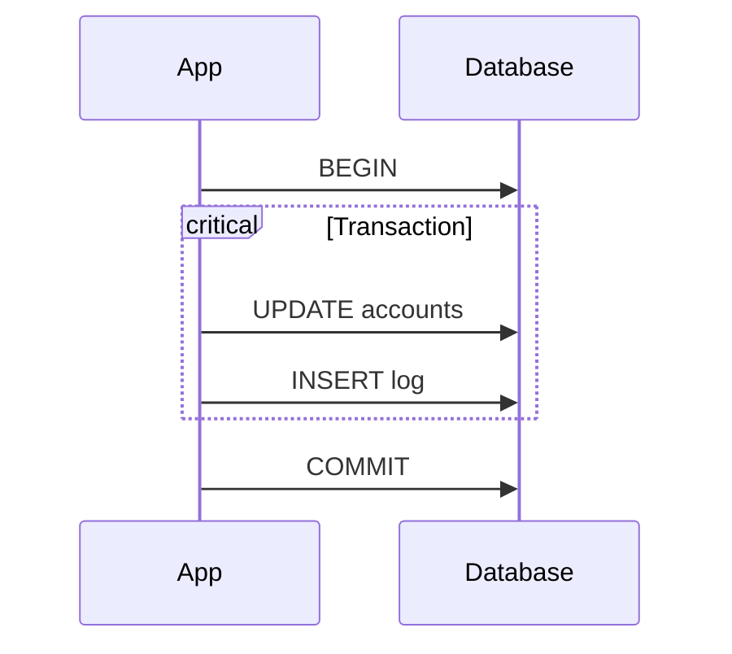

## Notes

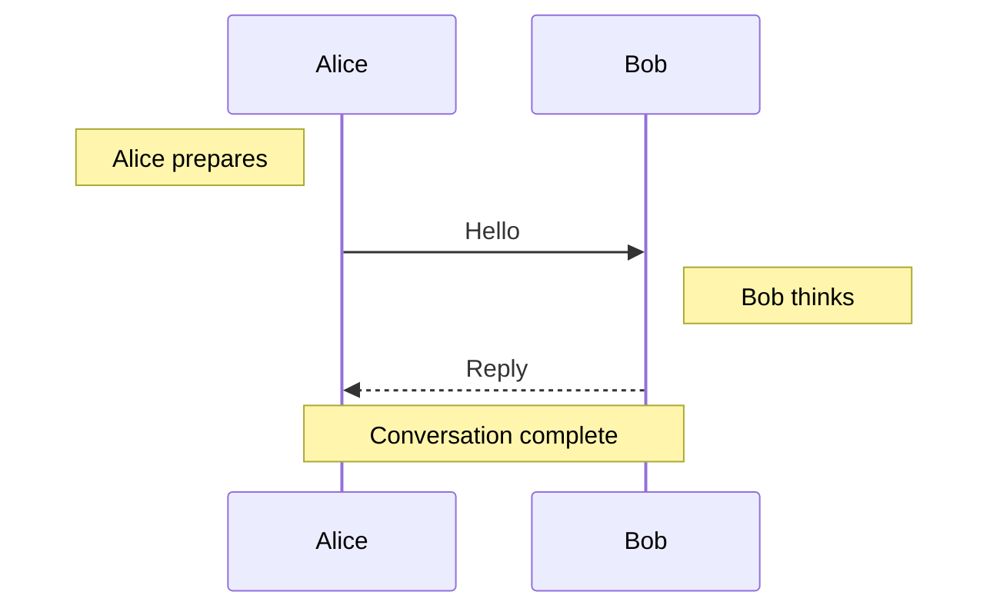

`Note over X,Y:` spans two lifelines — the right way to comment on an interaction rather than on
a participant.

## Worked example — OAuth 2.0

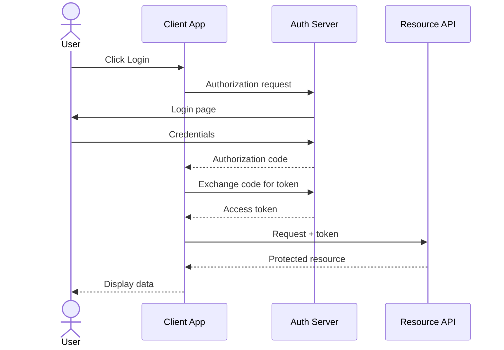

> A sequence diagram grows **down**, so length is cheap and width is not. Five participants is
> already a lot; past that, split the flow or collapse a group into one participant.
