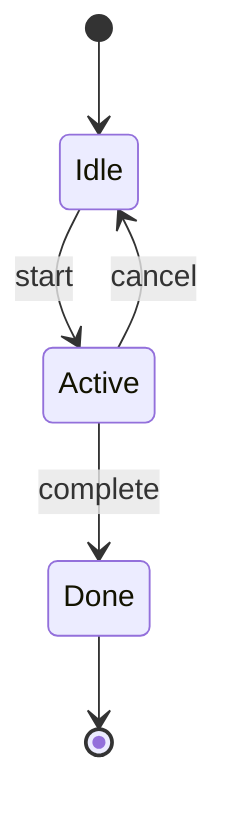
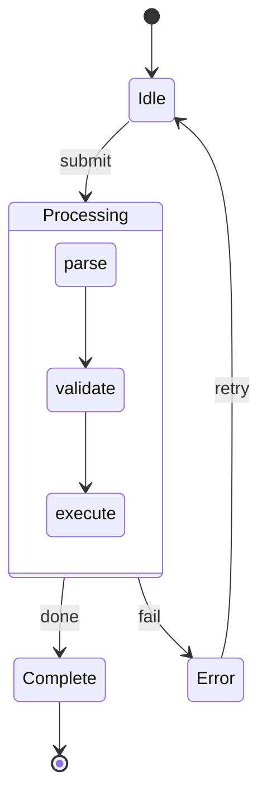
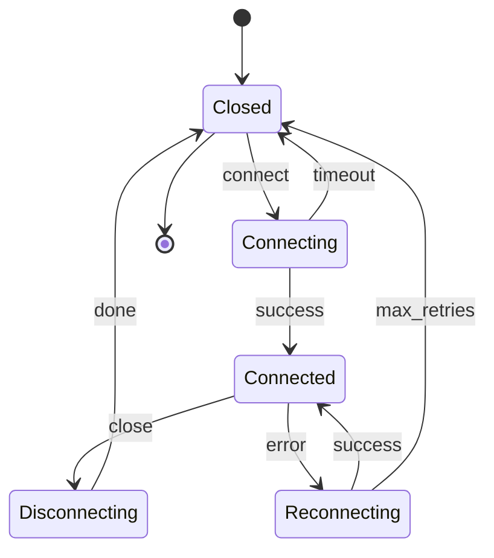

# State — `stateDiagram-v2`

For anything with a lifecycle: a status column, a connection, a job. If your text says «pending
→ processing → done | error», this is the diagram for it.

Open with `stateDiagram-v2` (plain `stateDiagram` is accepted too, `-v2` is the safer habit).

## The basics

- `[*]` is the pseudostate: as a source it is the entry point, as a target the terminal one.
- `A --> B : trigger` — the text after the colon is what causes the transition, not what happens
  during it. Name events (`submit`, `timeout`, `max_retries`), not actions.
- State names cannot contain spaces; CJK names work as-is.

## Composite states

A state can hold a machine of its own — this is how you show detail without a second diagram:

Transitions in and out of the composite attach to the whole block, so the inner machine stays
readable while the outer flow keeps its shape.

## Worked example — a connection lifecycle

## When to use this instead of a flowchart

A flowchart answers «what happens in what order», a state diagram answers «what can this thing
be, and what moves it». If the boxes are nouns the object *is* (`pending`, `error`), you want
states; if they are verbs someone *does* (`fetch`, `validate`), you want a flowchart.

> Every terminal state should reach `[*]`, and every state should be reachable from `[*]`. An
> orphan state in the picture is usually a real gap in the design, which is half the value of
> drawing it.
